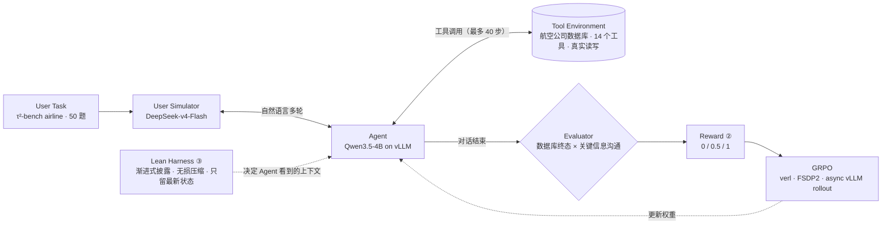
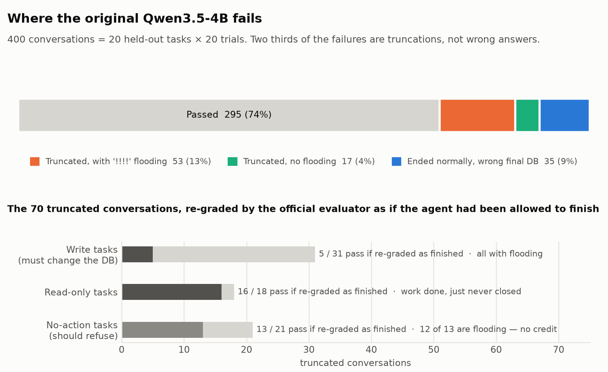
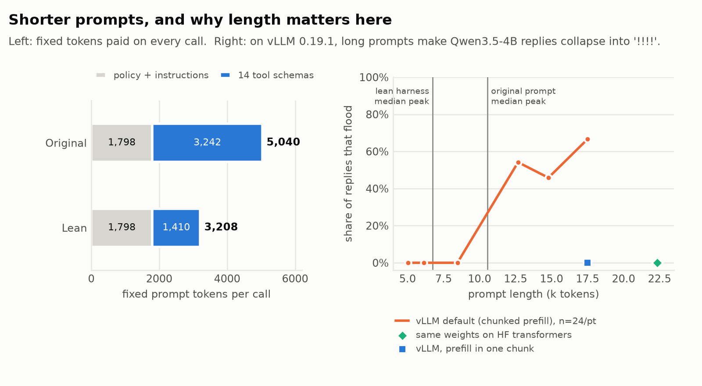
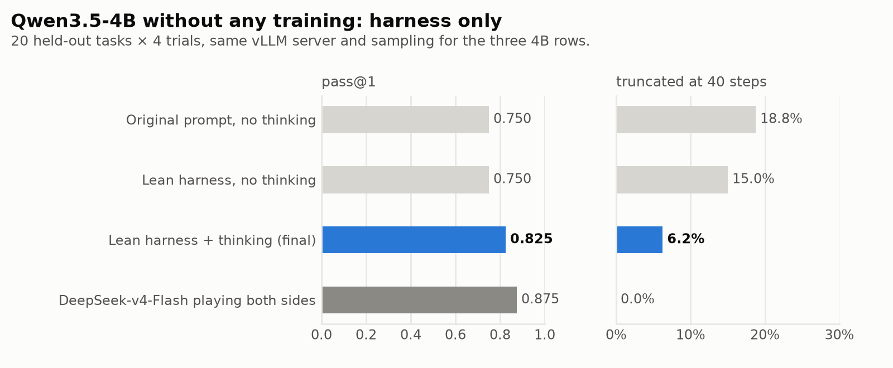

<div align="center">

# Airline Tool-Calling Agent

**Agentic RL × Harness Optimization on τ²-bench Airline · Qwen3.5-4B**

一个 4B 模型在长程多轮工具调用上的失败，三分之二不是答错，而是对话在步数上限处被截断。<br>
本项目从**训练侧（奖励）**和**推理侧（上下文）**两头各修一半，每个结论都附可复现的证据。


</div>

---

## 三个要点

| | 做了什么 | 关键结果（held-out 20 题 × 4 遍，\* = 逐题配对 95% 区间不含 0） |
|---|---|---|
| **① 闭环仿真与失败归因** | 搭建 User Task → User Simulator ↔ Agent ↔ Tool Environment 闭环，按"对话怎么结束的"拆解 400 条轨迹，并用官方判分器把截断的对话"放它收尾"重判一次 | 失败里 **66.7% 是撞 40 步被截断**；截断的对话里 **30%** 其实已满足成功条件 —— 0/1 奖励在误罚有效轨迹 |
| **② Completion-aware Reward + GRPO** | 被截断的对话按题型给 0 / 0.5 / 1，与 0/1 奖励、DAPO 超长过滤做只差一个变量的对照（各训 6 轮） | pass@1 **0.637 → 0.775（+13.8pp\*）**，截断率 **22.5% → 11.2%**；DAPO 超长过滤 0.762 / 18.8% —— 成功率打平，但只有 0.5 那组学会了收尾 |
| **③ Agent Harness & Context Engineering（零训练）** | 工具渐进式披露、工具返回无损压缩、历史对象只留最新状态；让 Qwen3.5 原生思考在 vLLM + tau2 上可用；定位长上下文刷屏的推理引擎根因 | 每轮固定 prompt **5,040 → 3,208 token（−36.3%）**，工具 schema **3,242 → 1,410（−56.5%）**；pass@1 **0.750 → 0.825**，截断率 **18.8% → 6.2%\***；DeepSeek-v4-Flash 参照 0.875 |

---

## 任务与设置



- **任务**：τ²-bench airline —— 客服 agent 要按航空公司政策，调用工具查询 / 改签 / 取消 / 订票，或者拒绝不合规的请求。用户模拟器按剧本扮演有目的的顾客（"我想改签但不想付钱……"）。
- **判分**：数据库终态与 gold 一致 × 该告诉用户的信息说到了（官方 `reward_basis` = DB × COMMUNICATE）。**结束原因不是正常结束（例如撞 40 步）直接记 0。**
- **划分**：30 道训练题 / 20 道 held-out 测试题；每题 4 遍；报 pass@1（主）、pass@4、pass^4、截断率。
- **训练**：Qwen3.5-4B 全参数 GRPO，verl 0.9（FSDP2 + vLLM async 多轮 rollout），单机 4 卡；每步 30 题 × 6 条 = 180 段完整对话。
- **统计**：比较一律**逐题配对 bootstrap**（对 20 道题重采样 10,000 次）。20 题上单组区间宽 ±0.13，两个绝对分相减没有意义。详见 [评测口径](docs/05_eval_protocol.md)。

---

## ① 闭环仿真与失败归因

<picture>
  <source media="(prefers-color-scheme: dark)" srcset="assets/fig_failure_dark.png">
  
</picture>

原模型在 20 道测试题 × 20 遍 = 400 段对话上通过 295 条（0.738）。105 条失败里：

- **70 条（66.7%）是撞 40 步被截断**，35 条是正常结束但数据库终态错；"该说的没说"0 条。
- 用 tau2 自己的判分器把截断的对话**改记成正常结束再判一次**（"如果允许它收尾，本来能不能过"）：
  - **只读题 16 / 18 能过**，gold 查询都做了 —— 活干完了，只是没收尾；
  - 写库题 5 / 31 能过，且全部伴随长上下文刷屏 —— 是跑飞了，不是差一步；
  - 应拒绝的题 13 / 21 "能过"，但其中 12 条是刷屏对话 —— 数据库本来就不该改，不代表干了活。
- 写库 + 只读题里能过的 **21 / 70 = 30%**。

> [!IMPORTANT]
> 官方 0/1 判分把"做对了没收尾"、"做错了"、"跑飞了"压成同一个 0。GRPO 的优势是组内相对量：一组全 0 就没有梯度，只要有一条成功，这三种失败又拿到同样的负优势 —— 模型学不到"在有限步数内收尾"。

一个真实例子（[`data/examples/truncated_but_done_task6.json`](data/examples/truncated_but_done_task6.json)）：用户想给已订的机票补买保险，政策不允许。客服查了预订、正确拒绝，但用户"绝不接受转人工"并反复追问，客服就反复转人工 —— 40 步用完，**0 分**，和"违规把保险加上了"拿同一个分。

→ 详细：[docs/01_failure_analysis.md](docs/01_failure_analysis.md)

---

## ② Completion-aware Reward + GRPO

**规则**（[`rl/tau2_reward.py`](rl/tau2_reward.py)）—— 每一条都来自上面的离线重判：

| 对话怎么结束的 | 题型 | 奖励 |
|---|---|---|
| 正常结束 | 任意 | 官方判分 **0 / 1** |
| 被截断（撞 40 步 / 生成预算用完 / 复读终止） | 写库题 | 改记正常结束重判，通过 → **0.5** |
| 同上 | 只读题 | 重判通过 **且** gold 查询全做过 → **0.5** |
| 同上 | 应拒绝的题 | **0**（"判对"不代表干了活） |

作用不是"多给分"，而是**在整组都失败时制造组内差异**，让"做完没收尾"的那几条浮起来。每轮 180 条 rollout 里实际拿到 0.5 的只有 2–8 条。

**实验设计**：三组从同一个 Qwen3.5-4B 起步，全参数 GRPO、所有超参逐项相同，只差"被截断的对话怎么处理"；各训 6 轮，每轮的 checkpoint 都测 held-out。**比较规则事先写下**：主比较 = 第 6 轮对第 6 轮。

<picture>
  <source media="(prefers-color-scheme: dark)" srcset="assets/fig_reward_dark.png">
  
</picture>

| 第 6 轮 checkpoint | pass@1 | pass@4 | pass^4 | 截断率 | 训练中截断数（第 1 → 6 轮，每轮 180 条） |
|---|---:|---:|---:|---:|---|
| **0 / 0.5 / 1 completion-aware** | **0.775** | **0.950** | 0.550 | **11.2%** | **30 → 11，单调下降** |
| 0 / 1 官方 | 0.637 | 0.850 | 0.400 | 22.5% | 31 → 27，无趋势 |
| 0 / 1 + DAPO 超长过滤（截断样本 mask） | 0.762 | 0.900 | 0.500 | 18.8% | 28 → 30，无趋势 |

| 逐题配对 | Δpass@1 | Δ截断率 |
|---|---|---|
| **completion-aware − 0/1，第 6 轮（主比较）** | **+0.138 [+0.025, +0.263]\*** | **−11.2pp [−21.2, −2.5]\*** |
| completion-aware − 0/1，第 5–6 轮合并 | **+0.087 [+0.013, +0.169]\*** | **−8.1pp [−15.6, −1.9]\*** |
| DAPO 超长过滤 − completion-aware，第 5–6 轮合并 | −0.006 [−0.069, +0.056] | **+5.6pp [+1.2, +10.6]\*** |

**为什么 DAPO 的超长过滤学不会收尾**：两者对同一批对话下了相反的处方 —— DAPO 把截断样本 mask 掉（减噪声），这里给它 0.5（造信号）。mask 等于对这类对话既不罚也不奖，模型没有理由改变它；而且删样本会让更多组失去方差（有梯度的组只剩 7–13 / 30），这正是 DAPO 要配 Dynamic Sampling 的原因。训练侧的机制也对得上：0.5 这一档在前三轮把有梯度的组从 13 / 13 / 14 提到 16 / 22 / 19。

> [!NOTE]
> **更稳的读法**：相对原模型，纯 0/1 的 GRPO 训 6 轮是**掉分**的（−0.100\*，截断 +5.0pp\*），completion-aware 把它守住了（pass@1 +0.038 不显著，pass@4 +0.062\*、截断 −6.2pp\*）。+13.8pp 同时吃了"0/1 组的最低轮"，第 5–6 轮合并的 +8.7pp 是更稳的数。单种子，要坐实需要换种子重训。

→ 详细（逐轮全表、训练日志诊断、与 DAPO 的逐条对比）：[docs/02_reward_design.md](docs/02_reward_design.md)

---

## ③ Agent Harness & Context Engineering（零训练）

一个权重都不动，只改客服模型每次调用时**看到的上下文**（[`harness/lean_agent.py`](harness/lean_agent.py)）。判分、题库、用户模拟器、步数上限全不变，轨迹里记录的仍是原始工具返回。

| | 做法 | 效果 |
|---|---|---|
| **工具渐进式披露** | 6 个写库工具只渲染"名字 + 一句描述"，模型真调用时丢弃这次生成、展开完整定义后重生成（不占步数）。请求里的 `tools=` 始终完整，解析器照常拿到参数类型；模板不传展开参数时与官方逐 token 相同 | 固定 prompt **5,040 → 3,208**；工具 schema **3,242 → 1,410**；50 题 × 4 遍展开 210 次全部成功 |
| **工具返回无损压缩** | 进入上下文前改写：航班搜索每班一行，其余去掉 JSON 引号和空字段。格式压缩，不是摘要 | 航班搜索 **−59% ~ −64%** |
| **历史对象只留最新状态** | 除最近 2 条外，每个预订号 / 用户号 / 航线+日期只保留最近一次返回，其余换成 14 token 的占位 | 模型没有因此反复重查（同参数重复读：3 → 2 次） |
| **长上下文刷屏兜底** | 历史里整轮 `!!!!` 的回复换成占位 | 四项叠加（回放估算）：≥ 9.6k token 的调用 **1,069 → 113** |

**让 Qwen3.5 原生思考真正可用**，定版之前修了三处：思考和回复原本共用每轮 2,048 上限（拆成思考 4,096 + 回复 2,048）；约 13% 的思考轮没写 `</think>` 就结束、vLLM 解析器把整段当思考 → 正文为空（回移上游 vLLM PR #35687，[插件](harness/qwen3_toolend_reasoning_parser.py)，13.3% → 7.0%）；剩下"只写了打算"的用它自己的思考补 `</think>` 同轮续写（164 / 164 成功）。定版评测 tau2 整段重开 0 次、infrastructure error 0 次。

<picture>
  <source media="(prefers-color-scheme: dark)" srcset="assets/fig_context_dark.png">
  
</picture>

**一个关键发现：原来"长对话就崩"主要不是模型能力问题。** 原模型 400 段对话里 102 段出现过整轮 `!!!!`，只在单次 prompt ≥ 9,651 token 时出现。把同一条对话截成不同长度各生成 12 次：vLLM 上 8.5k 以下 0/12、12.7k 以上 4–10/12；**同一份权重用 HF transformers 跑 22k token：0/12**；把 vLLM 的 `--max-num-batched-tokens` 调到 32,768（整段 prompt 一次预填）后 17.5k token：**12/12 → 0/12**。病根是 vLLM 0.19.1 的分块预填在 Qwen3.5 Gated DeltaNet 层上的数值故障。所以精简 harness 的一部分价值，是把 prompt 压到了故障门槛以下。

<picture>
  <source media="(prefers-color-scheme: dark)" srcset="assets/fig_harness_dark.png">
  
</picture>

| 同一台推理服务、同一套采样，20 题 × 4 遍 | pass@1 | pass^4 | 截断率 | 刷屏对话 |
|---|---:|---:|---:|---:|
| 原始 prompt · 不思考 | 0.750 | 0.550 | 18.8% | 25.0% |
| 精简 · 不思考 | 0.750 | 0.550 | 15.0% | 7.5% |
| **精简 · 思考（定版）** | **0.825** | **0.700** | **6.2%** | **0%** |
| DeepSeek-v4-Flash（同时扮演客服和顾客） | 0.875 | 0.750 | 0% | 0% |

- **单独精简不涨分**（+0.000），单独开思考也几乎不涨（旧引擎 2×2：+0.020）；**两项一起才显著**（旧引擎 50 题 +0.100 [+0.020, +0.185]\*）。只做精简时失败从"刷屏撞步"换成了"比价算错、选错航班"，思考要在上下文压短之后才有空间起作用。
- 同引擎下定版对原始 prompt：pass@1 +0.075 [−0.013, +0.175]、**截断率 −12.5pp [−22.5, −3.8]\***；与 DeepSeek 参照（50 题）pass@1 −0.050 [−0.150, +0.055]，统计上分不出高低，唯一显著落后的是截断率（9% vs 1%）。

→ 详细（逐项 token 账、探针过程、刷屏根因的全部对照）：[docs/03_context_harness.md](docs/03_context_harness.md)

---

## 两条线放在一起

- **治的是同一个病**："对话拖长 → 撞 40 步 → 记 0"。奖励线从后果一侧削（让"在预算内收尾"有梯度），外壳线从原因一侧削（不让上下文把推理弄坏）。两条线的收益签名几乎一样：涨的是只读题和应拒绝题，**写库题都没动**（0.672 → 0.667 / 0.722 → 0.694）—— 而 DeepSeek 恰好领先在写库题上（0.833）。
- 在所有 4B 配置上，通过的对话约 11 个客服轮、失败的 16–18 个；DeepSeek 通过 / 失败一样长（9.6 vs 9.2）。**对 4B 来说"失败"几乎等于"对话变长"**，对强模型不是。
- **不能直接叠加**：把部分分奖励第 6 轮的权重放进定版外壳，比原模型显著更差（0.725 vs 0.825，−0.100\*），思考的收益在它身上消失。权重绑定了训练时的外壳 —— 要合起来，训练 rollout 就得用同一个外壳、开同一种思考。

---

## 思考

1. **先做失败归因，再设计奖励。** 部分分奖励是从"400 条轨迹按题型离线重判"里推出来的，不是想出来的。之前一版过程奖励离线 AUC 很漂亮，上线后发现正优势 43–63% 发给了被截断、跑飞的对话 —— 离线 AUC 只证明相关，不证明推的方向对。能用 0 卡离线证伪的事，不要用 4 卡去证实。
2. **0/1 奖励的问题不只是稀疏，而是混淆。** 同一个 0 编码了三件毫不相干的事；分类之后再给分，比再造一个连续过程分更干净。
3. **同一个诊断可以有相反的处方。** DAPO 超长过滤和部分分都认为"截断记 0"是坏信号，一个删信号、一个造信号；实验把区别量了出来：成功率打平，只有造信号的那组学会了收尾。照搬论文里的单个技巧前，要看它依赖的其他部件（mask 依赖 Dynamic Sampling 补方差）。
4. **测量装置的故障会伪装成模型能力问题。** "4B 长对话就崩"是推理引擎的分块预填 bug；"开思考没用"是思考和回复抢同一个上限；"思考模式不回话"是解析器问题。判据：这个失败在更短的上下文、换一个推理后端、换一个解析器下还存在吗？
5. **每个兜底都要报触发次数，并查它有没有引入新问题。** 只用"重采"兜底的那一版分数更高（0.838），但靠 tau2 整段重开 73 次，失败的那次不计分 —— 定版宁可低一点，换"重开 0 次"。续写兜底触发 164 次，就去查它会不会编造写操作结果（84 条里 1 条，是复述已有预订）。
6. **剩下的差距很具体**：截断率（9% vs 1%）、每轮产出密度（每个客服轮 0.5 个工具调用 vs 0.73–0.96）、写库题的判断。下一步该教"每轮多干活、少说话"和写库前的核对，并让训练与评测共用同一个外壳。

→ 展开：[docs/04_insights.md](docs/04_insights.md)

---

## 局限

<details>
<summary>展开</summary>

- **规模小**：20 道测试题 × 4 遍，逐题配对区间半宽 ±0.06–0.13；单点差 ≤ 0.05 不作数。
- **单种子**：奖励线每组只训了一次；第 1、2 轮出现过方向相反的"显著"，6 轮各检验一次时纯噪声下至少一次假阳的概率约 26%。结论需要换种子重训或加测到每题 20 遍才能坐实（未做）。
- **比较规则的盲性**：规则写于 0/1 组六次评测之前，但部分分组第 6 轮的结果比规则早 15 分钟落盘。
- **对照细节**：DAPO 过滤组连续训 6 步（优化器状态保留），另两组是 3 + 3（中间 AdamW 清零一次）；它也不是完整 DAPO（保留 KL、无 Clip-Higher 和 Dynamic Sampling）。
- **两套推理引擎**：奖励线的评测和外壳线用的调用方式不同（工具解析器、采样、是否允许并行调用），跨引擎只比失败结构，不比绝对分。
- **DeepSeek 参照偏高**：同一个模型同时扮演客服和顾客，更容易"对上暗号"。
- **精简效应拆不开**：精简同时做了"避开推理故障"和"给更干净的上下文"两件事，在 vLLM 版本被驱动锁在 0.19.1 的机器上无法分离。
- **严格口径**：开思考后约 8.5% 的对话（全部 50 题）"库和话都对、但 gold 动作参数没对上"，严格口径下定版测试集为 0.713。

</details>

---

## 仓库结构与复现

```text
.
├── rl/                              # 训练侧（verl 0.9）
│   ├── tau2_reward.py               #   completion-aware 0 / 0.5 / 1 奖励
│   ├── tau2_agent_loop.py           #   多轮 agent loop：tau2 仿真原样跑在 GRPO rollout 里，逐 token 记 response_mask
│   ├── tau2_masked_adv.py           #   grpo_masked：被 mask 的样本不进组统计（DAPO 超长过滤对照）
│   ├── train_grpo.sh                #   启动脚本（ARM=partial / binary / mask），默认值即实验配置
│   ├── prepare_data.py · agent_loop.yaml
│   └── tests/
├── harness/                         # 推理侧（不训练）
│   ├── lean_agent.py                #   四项上下文精简 + 思考模式兜底
│   ├── chat_template_lean.jinja     #   官方模板 + expanded_tools 分支（不传时逐 token 等价）
│   ├── qwen3_toolend_reasoning_parser.py   # 回移 vLLM PR #35687 的思考解析器插件
│   ├── serve_vllm.sh · run_eval.sh · lean_tau2_cli.py
│   └── tests/
├── analysis/
│   ├── stats.py                     #   pass@k、逐题配对 bootstrap（只用标准库）
│   ├── reproduce.py                 #   重算本 README 与 docs/ 里的全部数字
│   └── make_figures.py
├── data/
│   ├── episodes.csv                 #   评测：每段对话一行（3,440 行、31 组），判分与行为字段
│   ├── train_rollouts.csv           #   训练：每条 rollout 一行（3,240 行）
│   ├── prompt_budget.json · flood_probe.json
│   └── examples/                    #   两段真实对话
├── tools/export_data.py             # 从 tau2 原始仿真导出上面两张表（含截断对话的官方判分器重判）
└── docs/                            # 01 失败归因 · 02 奖励设计 · 03 推理外壳 · 04 思考 · 05 评测口径
```

**重算全部数字**（不需要 GPU，也不需要装 tau2，约 10 秒）：

```bash
python analysis/reproduce.py              # 或只看一节：failure / reward / training / harness / stacking
```

**单测**（CPU）：

```bash
python rl/tests/test_masked_adv.py        # 需要 torch
python harness/tests/test_lean_agent.py   # 需要 tau2（τ²-bench）
```

**训练与评测**（需要 GPU、verl 0.9、vLLM 0.19、tau2，以及一个 OpenAI 兼容的用户模拟器接口）：

```bash
python rl/prepare_data.py --data-dir $TAU2_DATA_DIR --out data_rl/
ARM=partial RUN=partial_p1 MODEL=<Qwen3.5-4B> bash rl/train_grpo.sh                      # 前 3 轮
ARM=partial RUN=partial_p2 MODEL=runs/partial_p1/ckpts/global_step_3/actor/huggingface bash rl/train_grpo.sh   # 接着训 3 轮

MODEL=<模型目录> ENGINE=native bash harness/serve_vllm.sh &                                # 推理服务
MODE=lean_think RUN=eval_final bash harness/run_eval.sh                                    # 定版外壳评测
```

模型权重不在仓库里。

---

<sub>基于 [τ²-bench](https://github.com/sierra-research/tau2-bench)（环境、工具、用户模拟器框架与判分器）、[verl](https://github.com/volcengine/verl)、[vLLM](https://github.com/vllm-project/vllm) 与 [Qwen3.5](https://huggingface.co/Qwen)。本仓库的工作在其上：闭环接入与失败归因、completion-aware 奖励与对照实验、lean harness、思考模式修复与推理故障定位。</sub>
