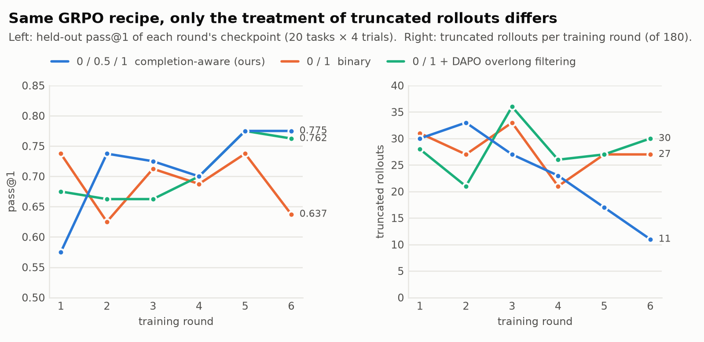

# 02 · Reward Design：completion-aware 0 / 0.5 / 1

> **一句话**：同一套 GRPO 配方只改"被截断的对话怎么记分"。第 6 轮 checkpoint 在 held-out 上，completion-aware 奖励 **pass@1 0.775 vs 0/1 奖励 0.637（+13.8pp，95% 区间不含 0）**，截断率 **11.2% vs 22.5%**。它和 DAPO 式超长过滤（0.762 / 18.8%）成功率打平，但**只有它让模型学会了在步数内收尾**：训练中的截断数 30 → 11 单调下降，另外两组没有趋势。

复现：`python analysis/reproduce.py reward training` · 代码：[`rl/tau2_reward.py`](../rl/tau2_reward.py)、[`rl/tau2_agent_loop.py`](../rl/tau2_agent_loop.py)、[`rl/tau2_masked_adv.py`](../rl/tau2_masked_adv.py)

---

## 1. 规则

| 对话怎么结束的 | 题型（按 gold 动作） | 奖励 |
|---|---|---|
| 正常结束（`user_stop` / `agent_stop`） | 任意 | 官方 DB × COMMUNICATE：**0 或 1** |
| **被截断**：撞 40 步；或 agent loop 截断（生成预算 16384 用完 / 客服轮数 30 用完 / 同一句回复 8 次） | 写库题 | 改记正常结束重判：通过 → **0.5**，否则 0 |
| 同上 | 只读题 | 重判通过 **且** gold 查询全部调用过 → **0.5**，否则 0 |
| 同上 | 无 gold 动作（应拒绝） | **0** |
| agent 出错等 | 任意 | 0 |
| 网关 / 基础设施报错 | 任意 | **剔除**：response_mask 全 0，不进 loss、不进组统计 |

每条规则都来自 [01 的离线重判](01_failure_analysis.md#3-关键一步把截断的对话放它收尾再判一次)：只读题截断后 16/18 已完成 → 给分；无 gold 题的"判对"几乎都是跑飞的对话 → 不给分；写库题给 0.5 而不是 1，因为截断时库恰好对的只有 5/31 且都伴随刷屏。

**它的作用不是"多给分"，而是在整组都失败时制造组内差异。** GRPO 的优势是 `(r − 组均值) / 组标准差`，一组 6 条全 0 就完全没有梯度；0.5 这一档让"做完没收尾"的那几条在组内浮起来。每轮 180 条 rollout 里实际拿到 0.5 的只有 2–8 条。

上线前的两层验证：
- 离线单测：用原模型 400 条已有轨迹跑一遍新奖励 —— 判分出错 0、满分 295、部分分（写库 5 / 只读 16 / 无 gold 0），与离线重判**逐项一致**；
- 冒烟：16 条 rollout，奖励缺失 0、判分出错 0。

## 2. 实验设计：只差一个变量

| | completion-aware（`ARM=partial`） | 0/1（`ARM=binary`） | 0/1 + DAPO 超长过滤（`ARM=mask`） |
|---|---|---|---|
| 截断的对话 | 按上表给 0.5 / 0 | 一律 0 | **response_mask 全 0**，不进 loss、不进组统计 |
| 优势估计 | GRPO | GRPO | `grpo_masked`：被 mask 的样本不进组均值（verl 自带的 grpo 不看 mask，会算错） |
| 其余逐项相同 | Qwen3.5-4B 起步；**全参数**，AdamW lr 1e-6 恒定；每步 30 题 × 6 条 = 180 段对话、mini-batch 2 题（15 次更新）；KL 0.001（low_var_kl）、clip 0.2、token-mean；生成预算 16384、每轮 2048、40 步；用户模拟器 DeepSeek-v4-Flash temp 0；verl 0.9，FSDP2 + vLLM async rollout，4 卡 | 同左 | 同左 |
| 流程 | 训 3 步 → 从第 3 步 checkpoint 接着训 3 步 | 同左 | 连续训 6 步（后补的对照） |

- 一步（step）= 30 道训练题全过一遍 = 一个 epoch，下文叫"一轮"。
- 每轮的 checkpoint 都在 20 道 held-out 题 × 4 遍上评测（旧口径引擎，见 [05](05_eval_protocol.md)），截断率 = 撞 40 步的对话占比。
- **比较规则事先写下**：主比较 = 第 6 轮对第 6 轮逐题配对 pass@1；辅助 = 第 5–6 轮合并（pass@1、截断率）；另报逐轮走势。否则 6 个 checkpoint × 2 组 = 12 个数，事后总能挑出想要的结论（第 1、2 轮确实出现过方向相反的"显著"）。

## 3. 结果

<picture>
  <source media="(prefers-color-scheme: dark)" srcset="../assets/fig_reward_dark.png">
  
</picture>

**逐轮（held-out 20 题 × 4 遍）**：pass@1 / pass@4 / pass^4 / 截断率

| 轮 | completion-aware | 0/1 | 0/1 + DAPO 超长过滤 |
|---|---|---|---|
| 1 | 0.575 / 0.900 / 0.250 / 21.2% | 0.738 / 0.850 / 0.550 / 17.5% | 0.675 / 0.800 / 0.600 / 26.2% |
| 2 | 0.738 / 0.900 / 0.450 / 18.8% | 0.625 / 0.800 / 0.350 / 22.5% | 0.662 / 0.900 / 0.400 / 22.5% |
| 3 | 0.725 / 0.900 / 0.550 / 17.5% | 0.713 / 0.850 / 0.550 / 18.8% | 0.662 / 0.850 / 0.450 / 23.8% |
| 4 | 0.700 / 0.850 / 0.450 / 18.8% | 0.688 / 0.850 / 0.500 / 21.2% | 0.700 / 0.850 / 0.500 / 25.0% |
| 5 | 0.775 / 0.900 / 0.550 / 13.8% | 0.738 / 0.900 / 0.550 / 18.8% | 0.775 / 0.900 / 0.600 / 17.5% |
| **6** | **0.775 / 0.950 / 0.550 / 11.2%** | **0.637 / 0.850 / 0.400 / 22.5%** | **0.762 / 0.900 / 0.500 / 18.8%** |

**逐题配对差**（对 20 道题 bootstrap 10000 次的 95% 区间，\* = 不含 0）

| 比较 | pass@1 | 截断率 |
|---|---|---|
| **主比较：第 6 轮 completion-aware − 0/1** | **+0.138 [+0.025, +0.263]\*** | — |
| 第 5–6 轮合并 completion-aware − 0/1 | **+0.087 [+0.013, +0.169]\*** | **−8.1pp [−15.6, −1.9]\*** |
| 6 轮全部合并 completion-aware − 0/1 | +0.025 [−0.027, +0.081] | −3.3pp [−6.5, −0.6]\* |
| 第 5–6 轮合并 DAPO 过滤 − completion-aware | −0.006 [−0.069, +0.056] | **+5.6pp [+1.2, +10.6]\*** |
| 第 5–6 轮合并 DAPO 过滤 − 0/1 | **+0.081 [+0.025, +0.138]\*** | — |

## 4. 机制证据：训练侧（比评测分更干脆）

每轮 180 条训练 rollout 里数一遍（`data/train_rollouts.csv`）：

| 每轮 180 条 | 1 | 2 | 3 | 4 | 5 | 6 | 趋势 |
|---|---|---|---|---|---|---|---|
| **completion-aware：截断条数** | 30 | 33 | 27 | 23 | 17 | **11** | **单调下降，−63%** |
| 0/1：截断条数 | 31 | 27 | 33 | 21 | 27 | 27 | 没有趋势 |
| DAPO 过滤：截断条数 | 28 | 21 | 36 | 26 | 27 | 30 | 没有趋势 |
| completion-aware：有梯度的组 / 30 | **16** | **22** | **19** | 14 | 11 | 12 | 前三轮明显更多 |
| 0/1：有梯度的组 / 30 | 13 | 13 | 14 | 11 | 14 | 12 | |
| DAPO 过滤：有梯度的组 / 30 | 11 | 9 | 11 | 13 | 9 | 7 | mask 让更多组失去方差 |
| completion-aware：平均客服轮 | 13.6 | 13.9 | 13.6 | 13.1 | 13.2 | **12.6** | 变短 |
| 0/1：平均客服轮 | 13.6 | 13.5 | 13.6 | 12.9 | 13.2 | 13.5 | 不变 |

两组读法：
- **奖励想教的行为（在预算内收尾）只在 completion-aware 组被学到了**；评测端截断率 21% → 11% 与之同向。
- **机制也对得上**：0.5 这一档在学习发生的早期把"有梯度的组"从 13/13/14 提到 16/22/19 —— 正是在制造组内方差。后三轮越来越多组变成全对，两组趋同。
- 三组训练全程网关报错 0；DAPO 组被 mask 的 rollout 共 168 条（每轮 21–36 条）。

## 5. 为什么不直接用 DAPO 的超长过滤

两者对同一批对话下了**相反的处方**：

| | DAPO Overlong Filtering | completion-aware |
|---|---|---|
| 截断的样本 | mask 掉，**不产生梯度** | 不 mask，按题型给 0.5，**产生梯度** |
| 目的 | 减噪声：截断的 0 分不反映答案质量 | 造信号：一组全 0 时没有方差就没有梯度 |
| 前提 | 数学题被截断时答案大概率没写完 | 实测只读题截断时 16/18 活已经干完 |

结果完全符合这个区别：
1. **成功率打平**：第 5–6 轮 pass@1 −0.006，区间跨 0。能说的是"0.5 不比它差，而且不用额外采样"。
2. **截断率显著不同**：mask 掉截断样本 = 告诉模型"这类对话不给任何信号"，它既不受罚也不被鼓励收尾 → 训练中截断数没有趋势，评测截断率 18.1% vs 12.5%（+5.6pp\*）。
3. **mask 会加重梯度饥饿**：组里样本被删掉后更容易全同 → 有梯度的组只剩 7–13 / 30。DAPO 原文把超长过滤和 **Dynamic Sampling**（丢掉无方差的组、重采到满 batch）放在一起不是巧合；本任务 30 道训练题里只有 11–12 道落在 0 < 成功率 < 1 的有效带，动态采样在这里会退化成静态筛题，本实验没有做。

> 严格说这一臂不是完整 DAPO：它是"DAPO 的超长过滤 + token-mean（verl 默认）"，保留了 KL、对称裁剪 0.2，没有 Clip-Higher 和 Dynamic Sampling。训练日志里上裁剪只命中 0.40–0.73% 的 token、熵 6 轮只掉约 0.02、pass@4 没有下降 —— 没有 Clip-Higher 要治的熵坍缩症状，所以没把它当变量。

## 6. 诚实的读法（与上面的结论一起报）

**相对原模型**（同引擎，原模型 20 遍）：

| 第 6 轮 | Δpass@1 | Δpass@4 | Δ截断率 |
|---|---|---|---|
| completion-aware | +0.038 [−0.030, +0.105] | **+0.062 [+0.004, +0.153]\*** | **−6.2pp [−11.5, −1.0]\*** |
| 0/1 | **−0.100 [−0.180, −0.032]\*** | −0.038 | **+5.0pp [+0.2, +10.5]\*** |
| DAPO 过滤 | +0.025 [−0.022, +0.075] | +0.012 | +1.2pp |

- **+13.8pp 的更稳读法是："纯 0/1 的 GRPO 在这套配置下训 6 轮是掉分的（−0.100\*），completion-aware 把它守住了，并显著降低了截断"**，而不是"completion-aware 让 pass@1 涨了 13.8 个点"。它相对原模型显著的是 pass@4 和截断率，pass@1 不显著。
- +0.138 同时吃了两头：completion-aware 第 6 轮是它的并列最高，0/1 第 6 轮是它六轮里的最低。**第 5–6 轮合并的 +0.087 是更稳的数**。
- 6 轮全部合并 pass@1 +0.025 不显著，效应集中在后两轮；第 1 轮 completion-aware 反而掉到 0.575（在只读 / 无 gold 题上乱发补偿券，第 2 轮起消失；训练里发券的对话全是 0 分负优势，推断是部分分让更多组有梯度、第一步更新偏大带出的漂移）。
- 单种子、单 checkpoint、每点 80 条对话；6 轮各做一次双侧检验，纯噪声下至少出现一次假阳的概率约 1 − 0.95⁶ ≈ 26%。**要坐实需要换种子重训，或末两轮加测到每题 20 遍**（都没做）。
- 比较规则写于 0/1 组六次评测之前，但 completion-aware 组第 6 轮的评测结果比规则早 15 分钟落盘 —— 取最后一轮是先验上合理的选择，但对这一组不是盲的。
- DAPO 过滤组是连续训 6 步（优化器状态保留），另两组是 3 + 3（中间 AdamW 状态清零一次）。
